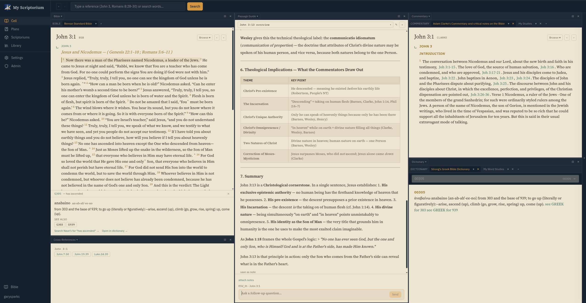
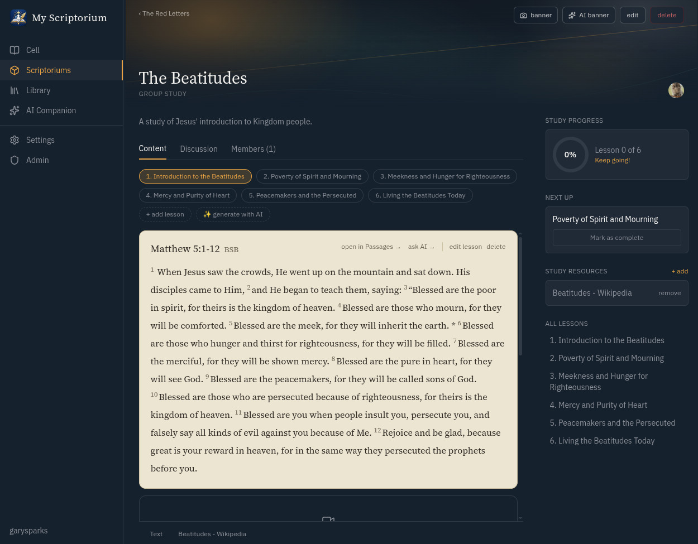

<p align="center">
  
</p>

<h1 align="center">Scriptorium</h1>
<p align="center">A self-hosted, multi-user Bible study platform built on the CrossWire SWORD engine.</p>

<p align="center">
  
  
</p>

Scriptorium is a self-hosted Bible study environment: real text from the SWORD engine (same library behind Ezra Bible App and Xiphos), an LLM study assistant grounded in the passages you actually have open, structured multi-week Studies with AI-drafted lesson outlines, and small-group coordination through Scriptoriums — all from one Docker container.

## What's in here

- **Cell (Reader)** — tiled, tabbed panes for Bibles, commentaries, dictionaries, cross-references, and a Passage Guide. Panes are resizable, reorderable by drag, and support parallel translations side-by-side.
- **Interlinear mode** — toggle any Bible pane into a word-by-word interlinear view showing the English word, Strong's number, and transliteration beneath each tagged word.
- **AI Companion** — a study assistant fed by whatever passages, commentaries, and notes you have open. Word Study and Phrase Study target a single Greek/Hebrew word or an exact phrase across the whole Bible. Save any assistant reply as a note or personal dictionary entry with one click.
- **Notes** — anchored to a passage or freestanding, full Markdown editor, searchable, with a "save as note" button on any assistant reply. Select any text in the reader to create a quoted note.
- **Personal modules** — your own commentary entries or dictionary definitions, saved and looked up exactly like a real SWORD module.
- **Markdown modules** — drop a folder of `.md` files into `MD_MODULES_PATH` and it appears in the pane module pickers alongside SWORD modules (no compilation required).
- **Reading Plans** — structured daily reading schedules with per-day completion tracking and one-click passage navigation.
- **PDF library** — upload reference PDFs and search their extracted text alongside Bible text and notes.
- **Scriptoriums** — invite-only or public study groups with a group feed (Scroll), an About page, shared Resources, a Members list, and a Daily Devotional sidebar.
- **Studies** — structured multi-week studies inside a Scriptorium: lessons with leader notes, per-lesson completion tracking, threaded discussion with likes, attached resources (commentary passages or links), and AI-drafted lesson outlines for any topic.
- **Admin** — module installation from CrossWire repositories, per-module visibility controls, user management, instance branding, and a metrics dashboard.

## Stack

- **Backend**: Node.js/Express + [`node-sword-interface`](https://github.com/ezra-bible-app/node-sword-interface) (native bindings to `libsword`)
- **Database**: PostgreSQL via Prisma — users, notes, highlights, bookmarks, PDF metadata, personal modules, Scriptoriums, Studies/lessons/progress, group feeds, and reading plans
- **Frontend**: React 18 + Vite + Tailwind CSS
- **Auth**: cookie sessions, argon2-hashed passwords, single-admin bootstrap, rate-limited login
- **LLM**: Anthropic API (Claude), used by Study Assistant, Word/Phrase Study, and AI-generated lesson drafts

## Running it

```bash
cp .env.example .env
# edit .env: set POSTGRES_PASSWORD and SESSION_SECRET,
# plus ANTHROPIC_API_KEY if you want the AI features

docker compose up --build
```

Then open **http://localhost:8088**.

⚠️ **First build is slow.** `node-sword-interface` compiles the SWORD C++ engine from source during `npm install` — expect several minutes on first build. Rebuilds are fast (Docker layer caching keeps the compiled engine unless `backend/package.json` changes).

## First run

1. **Bootstrap the admin account.** The app detects there's no user yet and prompts you to create the first account (becomes the instance admin). All subsequent accounts are regular users.
2. **Install Bible modules.** As admin, go to **Admin → Modules**, pick a CrossWire repository, and install a Bible (e.g. KJV, ESV, BSB). Commentaries, dictionaries, and daily devotionals install the same way. Modules download into a Docker volume and survive rebuilds.
3. Open the **Cell** to start reading.

## The Cell — reader panes

The Cell is a small window manager. Panes tile into resizable columns and rows; dragging a pane's header repositions it.

**Pane types:**

| Pane | What it does |
|---|---|
| Bible | Primary reading with Strong's tags, highlights, notes, verse selection |
| Commentary | SWORD or Markdown commentary text following the active reference |
| Dictionary | Browse or search SWORD dictionary entries; Strong's and cross-ref links are clickable |
| Cross-References | Human-readable cross-reference list with hover verse previews |
| Passage Guide | AI-powered study assistant contextualised to the open passage |
| Documents | PDF viewer/reader for uploaded reference books |

**Within each pane:**

- **Tabs** — open multiple modules in the same pane; each tab keeps its own scroll position.
- **Parallel translations** — add a second (or third) translation alongside the active one inside a single Bible pane.
- **Sync groups** — the colored dot on a pane header assigns it to a sync group (A, B, or C). Panes in the same group navigate together; the default Bible + Commentary pair start in group A.

## Reference parsing

`swordService.getPassage` handles anything `bible-passage-reference-parser` can parse:

- Single verse: `John 3:16`
- Range: `Romans 8:28-30`, cross-chapter: `John 3:16-4:2`
- Whole chapter: `John 3`
- Comma-separated: `John 3:16, 18` or `John 3:16-18, Romans 8:28`

The main search bar detects a valid reference and offers a direct "go to passage" jump above keyword matches. A single search hits Bible text, PDFs, and notes at once.

## Strong's, cross-references, footnotes

- Every Strong's-tagged word is clickable — definition, Greek/Hebrew text, transliteration, morphology, and "see also" cross-references open in a drawer.
- **Interlinear mode** — toggle the `⊞` button in any Bible pane margin to see a word-by-word stacked view: English word on top, Strong's number in the middle (clickable), transliteration below.
- Cross-references collapse to lettered superscript markers; clicking one opens a list with human-readable references (e.g. `John 3:16`, not `John.3.16`) and a verse text snippet on hover.
- Footnotes show the translator's note inline without a network round-trip.
- Dictionary entries in SWORD modules (Vine's, etc.) have clickable Strong's numbers and cross-reference links — Strong's opens the drawer, "see ABIDE" navigates to that entry.
- Bible references in commentary and dictionary prose are detected and made clickable.

## Notes and text selection

- **Verse selection** — click any verse number to select it; shift-click to extend the range. A toolbar appears with highlight colour swatches, a Note button (pre-fills with the verse reference), Copy, and "Ask about this →".
- **Text selection** — drag to select any span of words. A toolbar appears with Note (pre-fills with the quoted text), phrase study buttons, and highlight swatches. The Note opens an inline editor at the selection point.
- **Highlight colours** — five colours (yellow, blue, green, pink, purple); highlights persist per verse reference and show across sessions.
- Notes are edited with a full Markdown editor, are searchable from the Library or the main search bar, and can be saved directly from any assistant reply.

## Study Assistant, Word Study, and Phrase Study

The assistant and study tools live in the Passage Guide pane and the AI Companion panel.

- **Study Assistant** — persistent chat grounded in whatever passages, commentaries, and user notes are open across every reader pane. Context is rebuilt before each message. "Save as note" on any reply creates a note; the icon next to it saves a word/phrase study to My Word Studies (your personal dictionary).
- **Word Study** — click a Strong's-tagged word → takes the dictionary gloss, morphology, and every occurrence of that word across the whole Bible as context, then generates a structured study. Saved to My Word Studies with one click.
- **Phrase Study** — select any text span → study by exact English wording or by the underlying Strong's sequence (matches the original words regardless of translation). Also saved to My Word Studies.

All three require `ANTHROPIC_API_KEY` and a logged-in account.

## Reading Plans

The **Plans** view shows available reading schedules (admin-created or built-in). Each plan is a day-by-day schedule of passages; clicking a day's reading opens it in the Cell. Completion is tracked per day and shown with a progress indicator.

## Scriptoriums

Study groups with:

- **Scroll** — a shared group feed (posts + comments)
- **About** — rich-text description editable by the owner
- **Studies** — multi-week structured studies (see below)
- **Resources** — member-submitted links or notes
- **Members** — owner can invite, remove, or manage membership
- **Daily Devotional sidebar** — today's reading from whichever SWORD Daily module the admin has selected (Spurgeon, etc.)

Scriptoriums can be public (browse and join) or invite-only. Tags enable filtering on the list page.

## Studies

Structured studies that live inside a Scriptorium (or as a private solo study):

- **Lessons** — each lesson has a key verse (opens directly in the Cell), leader study notes, and a personal note editor for the participant.
- **Lesson editing** — study leaders can edit lesson titles, references, and notes; individual lessons can be deleted.
- **AI lesson drafts** — enter a topic and number of weeks and Claude drafts a full lesson outline, which becomes a set of real editable lessons.
- **Progress tracking** — mark lessons complete; a progress ring shows overall completion.
- **Discussion** — threaded comments with likes on each lesson.
- **Resources** — attach a commentary passage, a Bible module reference, a link, or a freeform note to any lesson; commentary resources fetch and display inline.

## Personal modules

Private, per-user commentary notes or dictionary definitions saved through the same UI as SWORD modules. Personal commentary entries support range-overlap matching — a note saved for `John 3:16-18` surfaces when reading verse 17. Word and phrase studies save to a personal dictionary module called **My Word Studies**.

## Markdown modules

A lightweight alternative to compiled SWORD modules. Drop a folder into `MD_MODULES_PATH` (default `/data/md-modules`) — or upload a `.zip` via **Admin → Modules** — and it appears in the pane module pickers alongside SWORD modules.

**Folder layout:**

```
my-commentary/
  module.json        ← metadata
  john.md            ← content keyed by ## headings
  genesis.md
```

**`module.json`:**

```json
{
  "name": "My Commentary",
  "description": "Shown in the module picker",
  "type": "COMMENTARY"
}
```

`type` is `COMMENTARY`, `DICT`, or `BIBLE`.

**Commentary and Bible text** — one `.md` file per book. Sections are `## chapter:verse` headings; `## chapter` headings are a fallback for chapter-level content:

```markdown
## 3:16

For God so loved the world — *agapē* here is not sentimental affection
but a determined, self-giving will toward another's good.

## 3:17

A necessary corrective: the Son came as the way *out* of condemnation,
not as its executor.
```

**Dictionary** — `## Entry Name` sections in any `.md` file, or one file per entry with the filename as the key:

```markdown
## Grace

The Greek *charis* (χάρις) — unmerited favor...

## Faith

*Pistis* (πίστις) — trust, confidence, belief...
```

Full Markdown renders (bold, italic, headings, lists, links). Commentary modules are automatically included in the Passage Guide AI context. **Installing via zip:** zip the module folder and upload it in **Admin → Modules**; the upload auto-detects SWORD vs. Markdown format. An example zip is at `modules/example-commentary.zip`.

## PDF library

Admins upload reference PDFs; all users can browse and search. Extracted text (capped at 200K chars per doc) is included in the main search alongside Bible text and notes.

## Admin

- **Modules** — install from CrossWire repositories by type (BIBLE, COMMENTARY, DICT, DAILY); per-module visibility toggle for regular users; `.zip` upload for offline installs (auto-detects SWORD vs. Markdown format)
- **Daily Devotional** — select which installed Daily module shows in the Scriptorium sidebar
- **Reading Plans** — create and manage reading schedules
- **Users** — create and list user accounts
- **Branding** — set the instance display name
- **Metrics** — DB health and usage counts

## Auth model

- First run bootstraps a single admin account; all other accounts are normal users.
- Sessions are cookie-based with a 30-day rolling window, backed by `connect-pg-simple`.
- `requireLogin`/`requireAdmin` middleware gates entire routers — a new route added to a guarded file can't accidentally ship unprotected.
- Reading Bible text and the PDF library stays public; creating content or spending API credits requires login.
- Login and the bootstrap endpoint are both rate-limited.

## Project layout

```
backend/
  src/
    routes/       auth, admin, bible, commentary, dictionary, strongs,
                  search, modules, personal-modules, notes, highlights,
                  bookmarks, context, phrase-study, word-study, pdf,
                  branding, scriptoriums, studies, wall, users,
                  uploads, devotionals, reading-plans, metrics
    services/     swordService, contextBuilder, pdfService, authService,
                  scriptoriumService, studyService, wallService,
                  devotionalService, personalModuleService, mdModuleService,
                  moduleVisibilityService, brandingService, metricsService
    middleware/   auth.js (requireLogin/requireAdmin), errorHandler.js, upload.js
    db/prisma.js
  prisma/schema.prisma, prisma/migrations/
frontend/
  src/
    components/   AppShell, CellView, WorkspaceLayout, ReaderPane,
                  DictionaryPane, CrossRefPane, PassageGuidePane,
                  StudyAssistant, AICompanionView, ScriptoriumsView,
                  StudyDetail, LibraryView, ReadingPlanView,
                  AdminView, SettingsView, and more
    hooks/        useAuth, useWorkspaceLayout, useTabbedWindow,
                  useResizableWidth/Height
    utils/        osisToHuman, parseInterlinear, abbreviateTitle
    api/client.js thin fetch wrapper — one method per backend endpoint
```

## Known limitations

- **Module install is synchronous** — the HTTP request blocks until the download finishes. Large modules want an SSE/WebSocket progress stream.
- **PDF search** uses a basic `ILIKE` query; swap `pdfService.searchDocuments` for Postgres full-text search once the library grows.
- **No built-in TLS** — put a reverse proxy in front before exposing this to the open internet.

## Design

Dark ink/parchment palette with a brass accent for primary actions and a verdigris accent for cross-references and annotations. Source Serif 4 for display text, IBM Plex Sans for UI, IBM Plex Mono for module codes and references.
